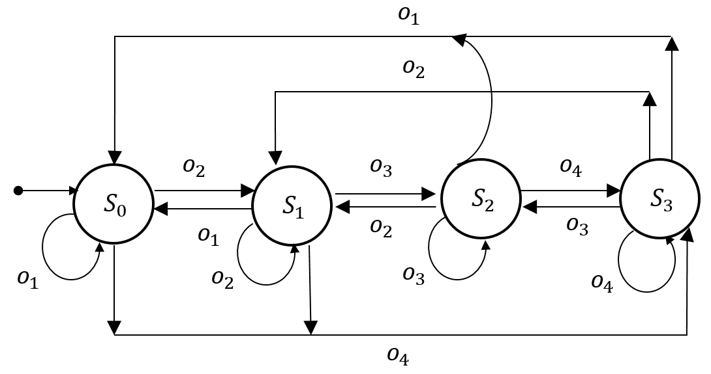
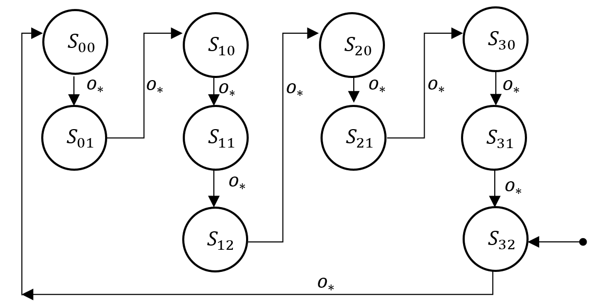
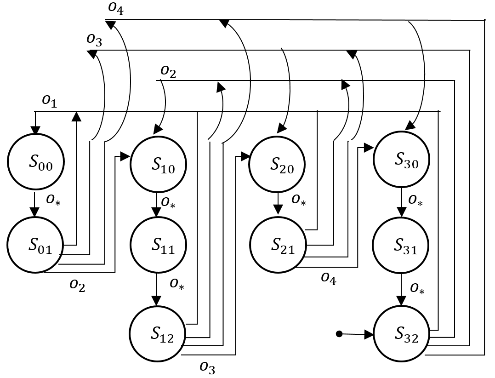

# Gold Rush Environments
GoldRush is an environment with a single agent that needs to collect gold at every time-step to survive and the objective is to maximize the survival time.
The underlying states of the environment are defined by ```M=4``` modes of operation.

* <b>Observation Space:</b>
    * <i>o<sub>t</sub> ɛ { o<sub>1</sub> ... o<sub>4</sub> }</i>
    * <i>o<sub>*</sub> => Transaction is valid for all possible observations</i>
* <b>Minimal State Machine:</b>
    * <b>GoldRushRead-v0</b>
        * requires attention to current observation only. (No Memory required)
        * States are denoted by <i>S<sub>(action)</sub></i>

        <p align="center">
            
        </p>

    * <b>GoldRushBlind-v0</b>
        * Only Memory required (Observations are irrelevant)
        * States are denoted by <i>S<sub>( action) (clock-id)</sub></i>

        <p align="center">
            
        </p>

    * <b>GoldRushSneak-v0</b>
        * requires attention to both memory and observations
        * States are denoted by <i>S<sub>( action) (clock-id)</sub></i>
        <p align="center">
            
        </p>